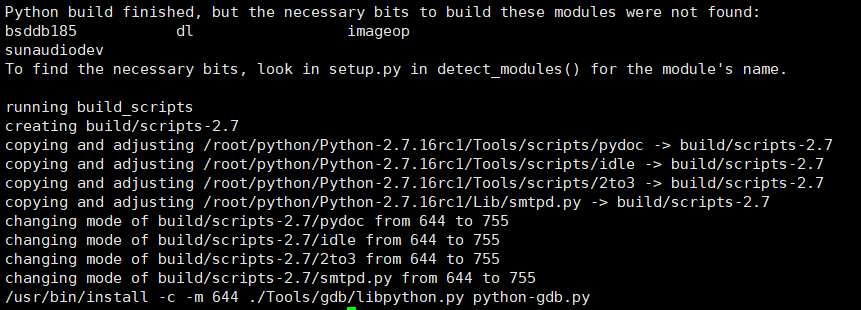

# Ubuntu 18.10 下安装Python2
   此次采用源代码格式进行安装

### 一、下载Python源代码

```shell
wget https://www.python.org/ftp/python/2.7.16/Python-2.7.16rc1.tgz
tar -zxvf Python-2.7.16rc1.tgz
cd Python-2.7
```

##  二、安装Python

```shell
./configure
make
sudo make install
```

在make的时候出现了如下错误：

```shell
Python build finished, but the necessary bits to build these modules were not found:
bsddb185           dl                 imageop         
sunaudiodev                                           
To find the necessary bits, look in setup.py in detect_modules() for the module's name.
running build_scripts
creating build/scripts-2.7
copying and adjusting /root/python/Python-2.7.16rc1/Tools/scripts/pydoc -> build/scripts-2.7
copying and adjusting /root/python/Python-2.7.16rc1/Tools/scripts/idle -> build/scripts-2.7
copying and adjusting /root/python/Python-2.7.16rc1/Tools/scripts/2to3 -> build/scripts-2.7
copying and adjusting /root/python/Python-2.7.16rc1/Lib/smtpd.py -> build/scripts-2.7
changing mode of build/scripts-2.7/pydoc from 644 to 755
changing mode of build/scripts-2.7/idle from 644 to 755
changing mode of build/scripts-2.7/2to3 from 644 to 755
changing mode of build/scripts-2.7/smtpd.py from 644 to 755
/usr/bin/install -c -m 644 ./Tools/gdb/libpython.py python-gdb.py

```




不管它，继续安装

## 三、安装python其它模块

### 1. setuptools的安装

```shell
wget https://github.com/pypa/setuptools/archive/v40.8.0.tar.gz
 tar -zxvf v40.8.0.tar.gz 
 python setup.py install
```

安装此模块主要是为了使用easy_install

### 2.pip模块的安装

```shell
wget https://files.pythonhosted.org/packages/36/fa/51ca4d57392e2f69397cd6e5af23da2a8d37884a605f9e3f2d3bfdc48397/pip-19.0.3.tar.gz
tar -zxvf 
tar -zxvf pip-19.0.3.tar.gz 
cd pip-19.0.3/
python setup.py install

```


